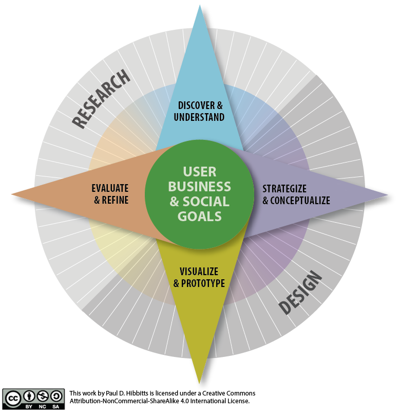

## What is usability and user experience design?

[plugin:page-inject](/211/weekly-readings/week-01-1?template=partials/embedlycardlinkonly)  
[plugin:page-inject](/211/weekly-readings/week-01-2?template=partials/embedlycardlinkonly)  

===

## **What is usability and user experience design?**

### One-Minute Summaries and Questions  

[plugin:page-inject](/211/lms-assignments/one-minute-summaries/week-01-1)  
[plugin:page-inject](/211/lms-assignments/one-minute-summaries/week-01-2)  

### Weekly Quiz

[plugin:page-inject](/211/lms-assignments/weekly-review-quizzes/week-02)

### Required Readings  

[plugin:page-inject](/211/weekly-readings/week-01-1)  
[plugin:page-inject](/211/weekly-readings/week-01-2)  

[pdf]https://qofr.files.wordpress.com/2016/11/q-of-r-presentation-11.pdf[/pdf]

### BlackBoard Collaborate Session Slides

[The Process of UX Design — Mini-lectures and Activities](https://docs.google.com/presentation/d/e/2PACX-1vQxbBtPCrm69bKNKMdq8DjdC48E86dEChu9uhrlAzAuFl0ShhwP4MHH9eJSZtb7fxto6SeeYEuzDf8r/pub?start=false&loop=false&delayms=3000) | [PDF](#) | [Recording](https://canvas.sfu.ca/courses/56304/external_tools/3544) (Look in Hamburger [fa="bars" /]menu)

[googleslides]https://docs.google.com/presentation/d/e/2PACX-1vQxbBtPCrm69bKNKMdq8DjdC48E86dEChu9uhrlAzAuFl0ShhwP4MHH9eJSZtb7fxto6SeeYEuzDf8r/embed?start=false&loop=false&delayms=3000[/googleslides]

[Week 2 Review and Discussion](https://docs.google.com/presentation/d/e/2PACX-1vQxbBtPCrm69bKNKMdq8DjdC48E86dEChu9uhrlAzAuFl0ShhwP4MHH9eJSZtb7fxto6SeeYEuzDf8r/pub?start=false&loop=false&delayms=3000) | [PDF](#) | [Recording](https://canvas.sfu.ca/courses/56304/external_tools/3544) (Look in Hamburger [fa="bars" /]menu)

[googleslides]https://docs.google.com/presentation/d/e/2PACX-1vQxbBtPCrm69bKNKMdq8DjdC48E86dEChu9uhrlAzAuFl0ShhwP4MHH9eJSZtb7fxto6SeeYEuzDf8r/embed?start=false&loop=false&delayms=3000[/googleslides]

### CMPT-363 UX Design Process/Toolkit

### Downloads

[Product Reaction Cards](https://canvas.sfu.ca/courses/56304/files/folder/Downloads/Product%20Reaction%20Cards)  

### Supplemental Readings  

[plugin:content-inject](/211/ux-techniques-guide/what-is-usability-and-user-experience-design/agile-ux)  
[plugin:content-inject](/211/ux-techniques-guide/what-is-usability-and-user-experience-design/design-ethics)  
[plugin:content-inject](/211/ux-techniques-guide/what-is-usability-and-user-experience-design/journey-mapping)  
[plugin:content-inject](/211/ux-techniques-guide/what-is-usability-and-user-experience-design/lean-ux)  
[plugin:content-inject](/211/ux-techniques-guide/what-is-the-practice-of-multidevice-interaction-design/problem-statements)  
[plugin:content-inject](/211/ux-techniques-guide/what-is-usability-and-user-experience-design/scenario-based-design)  
[plugin:content-inject](/211/ux-techniques-guide/what-is-usability-and-user-experience-design/usability)  
[plugin:content-inject](/211/ux-techniques-guide/what-is-usability-and-user-experience-design/user-centered-design)   
[plugin:content-inject](/211/ux-techniques-guide/what-is-usability-and-user-experience-design/user-experience-design)
